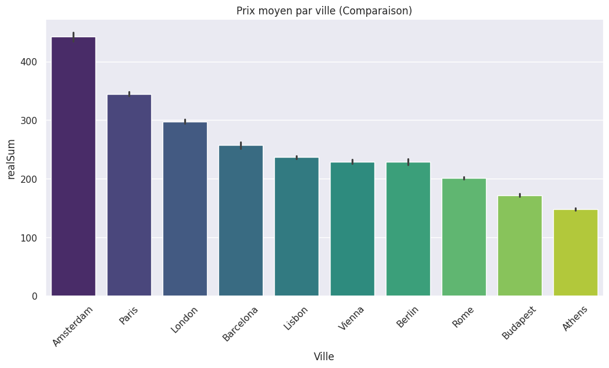

#  Analyse de Données : Marché Airbnb Europe

> **Projet Académique - Janvier 2026**
> *Analyse exploratoire des déterminants de prix sur 10 capitales européennes.*


---

##  Contexte du Projet
Dans le cadre de mon atelier de développement, j'ai analysé un jeu de données réel concernant les locations Airbnb.
L'objectif était de manipuler un dataset complexe, de le nettoyer et d'en tirer des conclusions stratégiques pour un investisseur potentiel.

**Périmètre de l'étude :**
* **10 Villes :** Paris, Londres, Amsterdam, Berlin, Barcelone, Lisbonne, Rome, Vienne, Budapest, Athènes.
* **Volume :** Environ 50 000 lignes de données.
* **Variables :** Prix, Distance du centre, Type de logement, Statut Superhost, Satisfaction client.

---

##  Travail Réalisé

### 1. Préparation des données (`pandas`)
* Importation automatisée des 20 fichiers CSV (Week-end et Semaine).
* Nettoyage des valeurs aberrantes (suppression des prix > 800€ qui faussaient les moyennes).
* Création de nouvelles colonnes : `Prix_Par_Personne` et catégorisation de la `Zone` (Centre / Banlieue).

### 2. Analyse Exploratoire
J'ai cherché à répondre à la question : **"Quels sont les facteurs qui font varier le prix d'une nuit ?"**

* **Comparaison des villes :** Amsterdam est la ville la plus chère de l'échantillon, suivie de Londres.
* **Impact de la distance :** On observe une corrélation négative. Plus on s'éloigne du centre, plus le prix baisse (logique, mais quantifié ici).
* **Effet Superhost :** J'ai analysé si les Superhosts étaient plus chers ou mieux notés.

---

##  Visualisations Clés

####  Distribution des Prix par Ville
On voit clairement que les villes du Nord (Amsterdam, Londres) sont plus chères que celles du Sud ou de l'Est (Athènes, Budapest).



####  Prix vs Distance au Centre
Nuage de points montrant la concentration des prix élevés dans les 5 premiers kilomètres.


####  Impact du statut Superhost
Les Superhosts ont des notes de satisfaction plus élevées et constantes.


---

##  Conclusions & Insights
1.  **La localisation prime :** L'hyper-centre (< 2km) concentre la valeur. Investir en périphérie lointaine nécessite une décote importante à l'achat pour rester rentable.
2.  **La propreté est cruciale :** L'analyse des corrélations montre que la note de propreté est le facteur le plus lié à la satisfaction globale.
3.  **Opportunité :** Les villes comme **Budapest** ou **Lisbonne** offrent un excellent rapport qualité/prix (satisfaction élevée pour un prix moyen modéré), idéal pour un investissement touristique accessible.

---

##  Installation
Pour reproduire cette analyse :

1.  Cloner le projet :
    ```bash
    git clone [https://github.com/PSEUDO/Projet_Airbnb.git](https://github.com/PSEUDO/Projet_Airbnb.git)
    ```
2.  Installer les librairies : `pip install -r requirements.txt`
3.  Lancer le notebook `Projet_Airbnb.ipynb` via Jupyter ou Google Colab.

---
*Projet réalisé par DIOP Issa - Étudiant Data Analyst*
